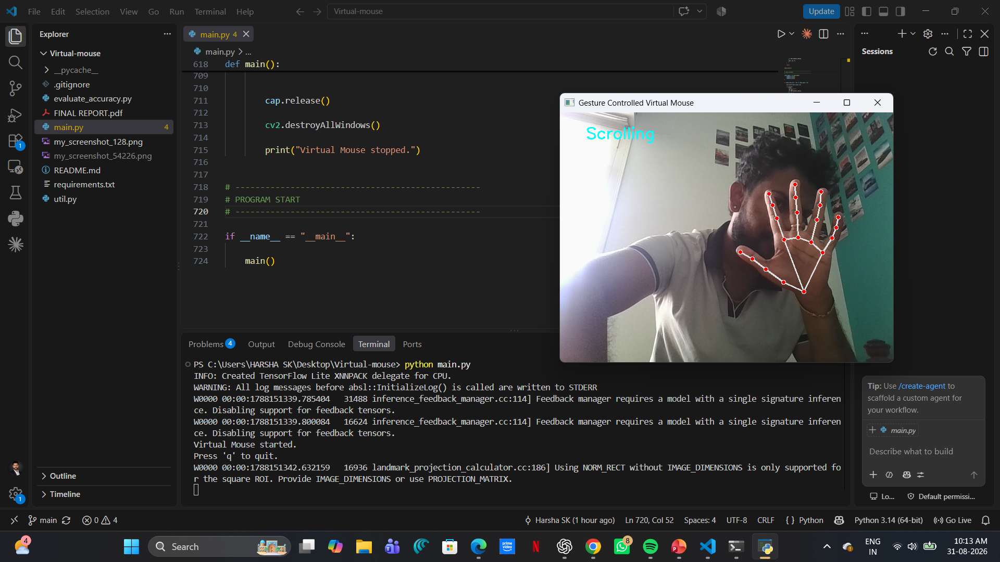

# 🖱️ Gesture Controlled Virtual Mouse

A real-time computer vision application that enables **touchless computer interaction** using hand gestures captured through a webcam.

The system uses **MediaPipe** for hand landmark detection, **OpenCV** for real-time video processing, and **PyAutoGUI/Pynput** for system-level mouse control.

---

## ✨ Key Highlights

- 🖐️ Real-time hand tracking using MediaPipe
- 🖱️ Gesture-based cursor movement
- 👆 Left click, right click, and double click
- 📜 Scroll control
- 🤏 Drag-and-drop interaction
- 📸 Gesture-based screenshot capture
- 🎥 Webcam-based real-time interaction
- ⚡ Real-time gesture recognition and system control
- 📊 Gesture accuracy evaluation support

---

## 📸 Demo

The application uses hand gestures to control the computer cursor and perform common mouse operations without physical contact.

---

## 🚀 Features

### 🖱️ Mouse Control

- Move the cursor using the index finger
- Perform left clicks using hand gestures
- Perform right clicks using hand gestures
- Perform double clicks
- Scroll vertically
- Drag and drop objects

### 🖥️ System Interaction

- Capture screenshots using a hand gesture
- Control the computer without a physical mouse
- Real-time webcam-based interaction

### 👁️ Computer Vision

- Real-time hand detection
- 21-point hand landmark tracking
- Finger position and angle analysis
- Distance-based gesture recognition
- Coordinate mapping between camera and screen

---

## 🛠️ Tech Stack

| Technology | Purpose |
|---|---|
| 🐍 Python | Core programming language |
| 👁️ OpenCV | Webcam input and real-time image processing |
| ✋ MediaPipe | Hand detection and 21-landmark tracking |
| 🖱️ PyAutoGUI | Cursor and screenshot automation |
| 🖱️ Pynput | Mouse click and drag control |
| 🔢 NumPy | Numerical and mathematical calculations |

---

## 🧠 How It Works

The system follows a real-time computer vision pipeline:

**📷 Webcam**  
          ↓  
**🎞️ Frame Capture**  
           ↓  
**👁️ OpenCV Processing**  
           ↓  
**✋ MediaPipe Hand Detection**  
           ↓  
**📍 21 Hand Landmarks**  
           ↓  
**🧠 Gesture Analysis**  
           ↓  
**🎯 Gesture Recognition**  
           ↓  
**🖱️ Mouse / System Action**

### 🔄 Processing Pipeline

1. The webcam continuously captures video frames.
2. OpenCV processes the incoming frames.
3. MediaPipe detects the hand and identifies **21 hand landmarks**.
4. Finger positions, angles, and distances between landmarks are analyzed.
5. The system determines which gesture is being performed.
6. The recognized gesture is mapped to a specific computer action.
7. PyAutoGUI or Pynput performs the corresponding system-level action.

---

## ✋ Gesture Controls

| Gesture | Action |
|---|---|
| ☝️ Index finger extended | Move cursor |
| 👆 Index finger + middle finger bent | Left click |
| 👉 Middle finger + index finger bent | Right click |
| ✌️ Two fingers bent | Double click |
| 🖐️ Index + middle fingers extended | Scroll |
| 🤏 Index finger extended + middle finger bent + thumb close | Drag and drop |
| 🤌 Both fingers bent + thumb close | Screenshot |

Gesture recognition is based on **finger angles, landmark positions, and distances between hand landmarks**.

---

## 📁 Project Structure

**Virtual-mouse/**

    ├── main.py
    ├── util.py
    ├── evaluate_accuracy.py
    ├── requirements.txt
    ├── README.md
    ├── FINAL REPORT.pdf
    ├── virtual-mouse-demo.png
    └── .gitignore

### 📄 File Description

| File | Description |
|---|---|
| `main.py` | Main application containing the virtual mouse logic |
| `util.py` | Utility functions used by the application |
| `evaluate_accuracy.py` | Gesture prediction evaluation script |
| `requirements.txt` | Required Python dependencies |
| `README.md` | Project documentation |
| `FINAL REPORT.pdf` | Project documentation and report |
| `virtual-mouse-demo.png` | Project demonstration image |
| `.gitignore` | Prevents generated and unwanted files from being committed |

---

## ⚙️ Requirements

Before running the project, make sure you have:

- Python 3.11
- A working webcam
- Windows, Linux, or macOS
- Internet connection for installing dependencies

---

## 📦 Installation

### 1. Clone the Repository

    git clone https://github.com/HarshaSK19/Virtual-mouse.git

### 2. Navigate to the Project Directory

    cd Virtual-mouse

### 3. Install Dependencies

    pip install -r requirements.txt

---

## ▶️ Run the Project

Start the virtual mouse application using:

    python main.py

A webcam window will open and the application will begin detecting hand gestures.

To stop the application, press:

    Q

---

## 📸 Gesture-Based Screenshot Capture

The project includes a gesture-based screenshot feature.

When the designated screenshot gesture is detected, the application captures the current screen and saves the screenshot as a PNG file.

Generated screenshots are excluded from Git using the project's `.gitignore` configuration.

---

## 📊 Gesture Accuracy Evaluation

The project includes an evaluation script:

    evaluate_accuracy.py

The script is designed to calculate:

- Overall accuracy
- True Positives (TP)
- False Positives (FP)
- False Negatives (FN)
- Precision
- Recall

Run the evaluation using:

    python evaluate_accuracy.py

The evaluation script expects a CSV file containing the **predicted gesture labels and corresponding true labels**.

> **Note:** Accuracy results are not currently reported because the project does not yet have a finalized benchmark dataset.

---

## ⚠️ Limitations

The current implementation has some practical limitations:

- Performance depends on webcam quality.
- Poor lighting can affect hand detection.
- The hand should remain visible within the camera frame.
- Gesture recognition can vary depending on hand position and orientation.
- Rapid hand movements may occasionally affect recognition.
- The current implementation is primarily designed for single-hand interaction.

---

## 🛠️ Troubleshooting

### 📷 Webcam Not Detected

- Make sure the webcam is connected and working.
- Close other applications that may be using the camera.
- Check camera permissions for Python or your operating system.

### ✋ Gestures Not Recognized

- Ensure your hand is clearly visible.
- Use adequate lighting.
- Keep your hand within the camera frame.
- Avoid excessive background clutter.
- Try maintaining a consistent distance from the webcam.

### 🖱️ Cursor Movement Is Unstable

- Keep your hand movements smooth.
- Maintain a reasonable distance from the camera.
- Ensure sufficient lighting for reliable landmark detection.

---

## 💡 Practical Applications

Gesture-controlled interfaces can be useful in areas such as:

- 💻 Touchless computer interaction
- ♿ Assistive technology
- 🎮 Interactive systems
- 🖥️ Contactless interfaces
- 🔬 Human-computer interaction research
- 🏠 Smart environment interfaces

---

## 🔮 Future Improvements

Possible future improvements include:

- 🖐️ Multi-hand gesture support
- 🎯 Improved cursor stabilization and smoothing
- 🧠 Machine-learning-based gesture classification
- ⚙️ Customizable gesture-to-action mapping
- 📈 Real-time performance monitoring
- 🖥️ GUI-based configuration
- 🔊 Voice and gesture hybrid control
- 📱 Integration with smart-device interfaces

---

## 👨‍💻 Author

### Harsha SK

**AI/ML & Data Science Enthusiast**

Interested in building practical solutions using:

- Artificial Intelligence
- Machine Learning
- Data Science
- Computer Vision
- Python
- Retrieval-Augmented Generation (RAG)

---

## ⭐ Support

If you find this project useful or interesting, consider giving the repository a ⭐ on GitHub.

---

## 📄 License

This project was developed for educational and project-development purposes.
